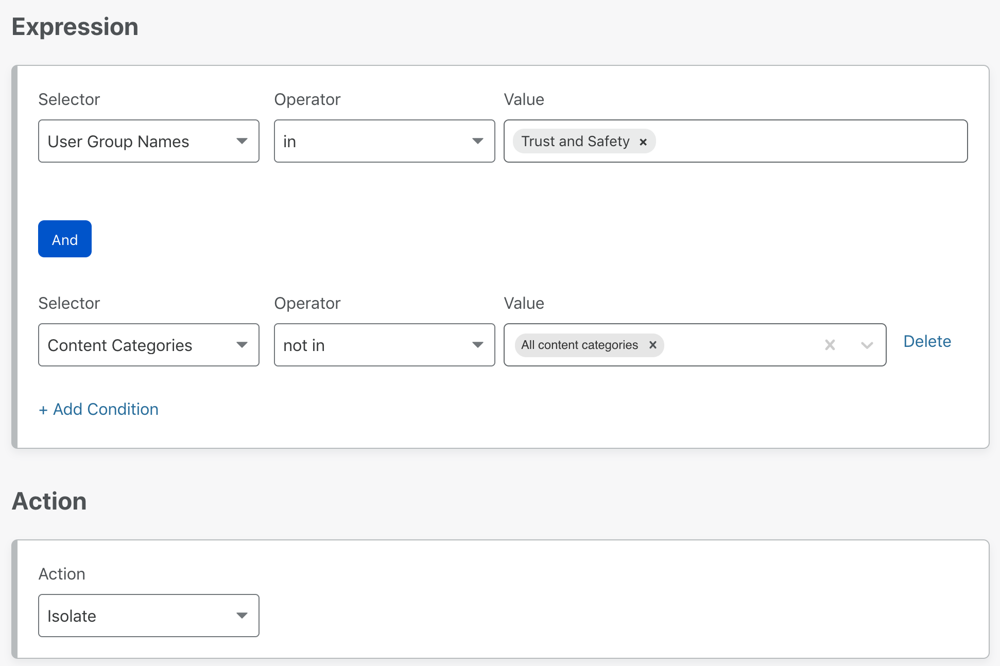

# Browser Isolation

Just like how you can use Gateway to allow or block traffic based on content categories or security threats, you can define Isolation policies to dynamically isolate websites based on identity, security threats or content. To build Browser Isolation policies, navigate to **Policies** > **HTTP policies** on the Teams Dashboard. In the rule builder, choose the *Isolate* or *Do not Isolate* actions to enable or disable isolation for certain websites or content.

## Isolate

When an HTTP policy applies the Isolate action, the user's web browser is transparently served a HTML compatible remote browser client. Isolation policies can be applied to requests that include `Accept: text/html*`. This allows Browser Isolation policies to co-exist with API traffic.

If you'd like to isolate **all security threats**, you can set up a policy with the following configuration:

| Selector | Operator | Value | Action |
| - | - | - | - |
| Security Threats | In | All security threats | Isolate

If instead you need to isolate **specific hostnames**, you can list the domains you'd like to isolate traffic to:

| Selector | Operator | Value | Action |
| - | - | - | - |
| Host | In | `example.com`, `example.net` | Isolate

<Aside type='note' header='Isolate identity providers for applications'>

Existing cookies and sessions from non-isolated browsing are not sent to the remote browser. Websites that implement single sign on using third-party cookies will also need to be isolated.

For example, if `example.com` authenticates using Google Workspace, you will also need to isolate the top level <a href="https://support.google.com/a/answer/9012184">Google Workspace URLs</a>.

</Aside>

## Do Not Isolate

You can choose to disable isolation for certain destinations or categories. The following configuration disables isolation for traffic directed to `example.com`:

| Selector | Operator | Value | Action |
| - | - | - | - |
| Host | In | `example.com` | Do Not Isolate |

## Settings

Malware and zero-day threats are not the only security challenges administrators face with web browsers. The mass adoption of SaaS products has made the web browser the primary tool used to access data. Lack of control over both the application and the browser has left administrators little control over their data once it is delivered to an endpoint.

All following settings can be applied to websites through Applications, Lists, Domain and Hostname expressions.

### Disable copy / paste

* **Behavior**. Prohibits users from copying and pasting content between a remote web page and their local machine.
* **Use Cases**. Protect sensitive content in self-hosted or SaaS applications from data loss.

### Disable printing

* **Behavior**. Prohibits users from printing remote web pages to their local machine.
* **Use Cases**. Protect sensitive content in self-hosted or SaaS applications from data loss.
